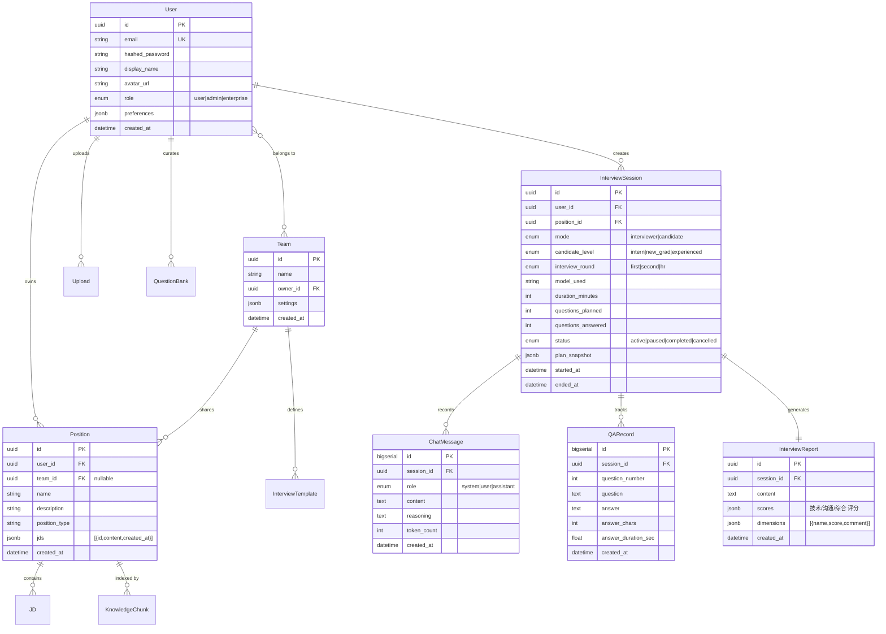
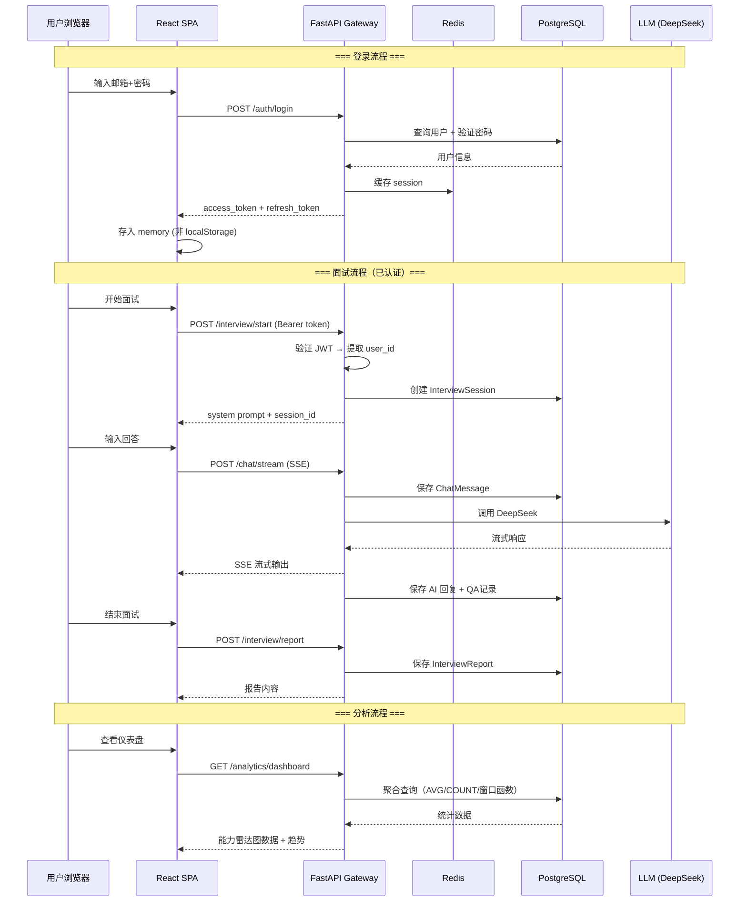

# 🏗️ Interview Agent 平台化架构设计

## 一、现状分析 → 目标架构

```
当前（单机工具）                      目标（SaaS 平台）
┌─────────────────┐          ┌─────────────────────────────┐
│  React SPA      │          │  React SPA + PWA            │
│  localStorage   │          │  JWT Token (HttpOnly Cookie) │
├─────────────────┤          ├─────────────────────────────┤
│  FastAPI        │          │  FastAPI + Middleware Stack  │
│  无用户系统      │          │  Auth / RateLimit / Tenant   │
│  JSON 文件存储   │   ──►    │  SQLAlchemy ORM + PostgreSQL │
│  无会话持久化    │          │  Redis (Session/Cache)       │
│  内存向量索引    │          │  PGVector / Milvus           │
├─────────────────┤          ├─────────────────────────────┤
│  本地部署        │          │  Docker Compose / K8s       │
│  单实例         │          │  水平扩展                     │
└─────────────────┘          └─────────────────────────────┘
```

## 二、核心设计决策

| 决策点 | 选择 | 理由 |
|--------|------|------|
| 数据库 | PostgreSQL + SQLAlchemy 2.0 Async | 成熟稳定、支持 JSONB/全文搜索/PGVector |
| 缓存 | Redis | Session 管理 + 限流 + 排行榜 |
| 认证 | JWT (access + refresh token) | 无状态、可扩展 |
| 迁移策略 | 渐进式：JSON→DB 双写 → 切换 → 清理 | 零停机迁移 |
| 向量存储 | FAISS(本地) → PGVector(平台) 可选升级 | 兼容现有、按需升级 |
| 前端状态 | Zustand + React Query | Server state 与 Client state 分离 |

## 三、数据库 ER 图



## 四、API 架构重构

```
/api/v1/                          # 版本化 API
├── auth/                         # 认证模块 [NEW]
│   ├── POST   /register          # 注册
│   ├── POST   /login             # 登录
│   ├── POST   /refresh           # 刷新令牌
│   ├── POST   /logout            # 登出
│   └── GET    /me                # 当前用户信息
│
├── chat/                         # 对话模块 [重构]
│   ├── GET    /models            # 可用模型列表
│   └── POST   /stream            # SSE 流式对话（需认证）
│
├── interview/                    # 面试模块 [重构]
│   ├── POST   /start             # 开始面试 → 创建 session
│   ├── POST   /stop              # 停止面试 → 结束 session
│   ├── POST   /plan              # 面试计划
│   ├── POST   /report            # 生成报告 → 持久化
│   └── GET    /sessions          # 历史会话列表 [NEW]
│   └── GET    /sessions/{id}     # 会话详情 + 消息回放 [NEW]
│
├── position/                     # 岗位模块 [重构]
│   ├── POST   /                  # 创建岗位
│   ├── GET    /                  # 岗位列表
│   ├── GET    /{name}            # 岗位详情
│   ├── PUT    /{name}            # 更新岗位
│   ├── DELETE /{name}            # 删除岗位
│   ├── POST   /{name}/jd         # 添加 JD
│   └── DELETE /{name}/jd/{id}    # 删除 JD
│
├── knowledge/                    # 知识库 [重构]
│   ├── POST   /upload            # 上传知识文件
│   ├── GET    /search            # 向量检索
│   └── DELETE /{position_name}   # 删除知识库
│
├── upload/                       # 上传模块 [重构]
│   ├── POST   /file              # 上传文件
│   ├── GET    /list              # 上传列表
│   └── DELETE /{id}              # 删除文件
│
├── analytics/                    # 分析模块 [NEW]
│   ├── GET    /dashboard         # 概览仪表盘
│   ├── GET    /progress          # 进步趋势
│   ├── GET    /weakness          # 薄弱项分析
│   ├── GET    /comparison        # 多次面试对比
│   └── GET    /stats             # 统计汇总
│
├── team/                         # 团队模块 [NEW]
│   ├── POST   /                  # 创建团队
│   ├── GET    /{id}              # 团队信息
│   ├── PUT    /{id}              # 更新团队
│   ├── POST   /{id}/members      # 邀请成员
│   └── DELETE /{id}/members/{uid}# 移除成员
│
├── template/                     # 面试模板 [NEW]
│   ├── POST   /                  # 创建模板
│   ├── GET    /                  # 模板列表
│   ├── GET    /{id}              # 模板详情
│   └── PUT    /{id}              # 更新模板
│
└── question-bank/                # 题库管理 [NEW]
    ├── POST   /                  # 添加题目
    ├── GET    /                  # 题目列表
    ├── GET    /{id}              # 题目详情
    ├── PUT    /{id}              # 更新题目
    ├── DELETE /{id}              # 删除题目
    └── POST   /import            # 批量导入
```

## 五、前端架构升级

```
src/
├── main.tsx                       # 入口：Provider 嵌套
├── App.tsx                        # 路由配置 + 守卫
│
├── api/                           # API 层（React Query）
│   ├── client.ts                  # Axios 实例 + 拦截器
│   ├── auth.ts                    # [NEW] 认证 API
│   ├── chat.ts
│   ├── interview.ts
│   ├── knowledge.ts
│   ├── position.ts
│   ├── upload.ts
│   ├── analytics.ts               # [NEW] 分析 API
│   ├── team.ts                    # [NEW] 团队 API
│   └── questionBank.ts            # [NEW] 题库 API
│
├── stores/                        # Zustand（仅客户端状态）
│   ├── authStore.ts               # [NEW] 认证状态
│   ├── appStore.ts                # 应用偏好
│   └── chatStore.ts               # 对话状态
│
├── hooks/                         # 自定义 Hooks
│   ├── useAuth.ts                 # [NEW] 认证 hook
│   ├── useSSE.ts
│   └── useModels.ts
│
├── pages/                         # 页面组件
│   ├── LoginPage.tsx              # [NEW] 登录注册
│   ├── ChatPage.tsx               # 面试对话（需认证）
│   ├── DashboardPage.tsx          # [NEW] 分析仪表盘
│   ├── HistoryPage.tsx            # [NEW] 历史记录
│   ├── ReportPage.tsx
│   ├── PositionPage.tsx
│   ├── KnowledgePage.tsx
│   ├── UploadPage.tsx
│   ├── TeamPage.tsx               # [NEW] 团队管理
│   ├── QuestionBankPage.tsx       # [NEW] 题库管理
│   └── SettingsPage.tsx           # [NEW] 个人设置
│
├── components/                    # 共用组件
│   ├── AuthGuard.tsx              # [NEW] 路由守卫
│   ├── ChatMessage.tsx
│   ├── ModelSelector.tsx
│   ├── ... (现有)
│   └── charts/                    # [NEW] 图表组件
│       ├── RadarChart.tsx         # 能力雷达图
│       ├── TrendChart.tsx         # 趋势折线图
│       └── Heatmap.tsx            # 薄弱项热力图
│
└── types/
    └── index.ts                   # 扩展类型定义
```

## 六、平台数据流



## 七、渐进式迁移路线图

```
Phase 1 ─ 基础设施（2周）
├── SQLAlchemy 2.0 Async ORM + Alembic
├── PostgreSQL / SQLite 双模式（开发用 SQLite，生产用 PG）
├── User 模型 + JWT 认证中间件
├── 数据库 Session 依赖注入
└── 前端登录/注册页面

Phase 2 ─ 数据迁移（1周）
├── PositionStore JSON → DB 适配器
├── UploadStore JSON → DB 适配器
├── 双写模式：新数据写 DB，旧数据兼容读
└── 数据迁移脚本

Phase 3 ─ 面试持久化（1周）
├── InterviewSession + ChatMessage 模型
├── 对话消息实时持久化
├── 历史会话列表/详情 API
├── 面试回放功能
└── 前端 HistoryPage

Phase 4 ─ 分析平台（1.5周）
├── 统计数据聚合 API
├── 能力雷达图（技术/沟通/综合）
├── 进步趋势折线图
├── 薄弱项分析 + 改进建议
├── DashboardPage 仪表盘
└── 报告 PDF 导出

Phase 5 ─ 平台化（2周）
├── 团队管理 CRUD
├── 面试模板库
├── 自定义题库
├── 团队共享岗位/模板
├── 免费/Pro 订阅限制
└── 管理员面板

Phase 6 ─ 增强（持续）
├── 语音面试（STT/TTS）
├── 英文面试模式
├── 在线代码执行沙箱
├── 企业 SSO 集成
└── 开放 API + 文档
```

## 八、关键安全设计

| 层面 | 措施 |
|------|------|
| 传输层 | HTTPS + HSTS |
| 认证层 | JWT (RS256) + refresh token rotation + 设备指纹 |
| 授权层 | RBAC (user/admin/enterprise_admin) + 资源归属校验 |
| 数据层 | 密码 bcrypt 哈希、PII 加密存储、API Key AES 加密 |
| 应用层 | Rate Limiting (Redis)、CORS 白名单、SQL 注入防护(ORM) |
| 基础设施 | Docker 非 root 运行、Secrets 管理、定期安全审计 |
